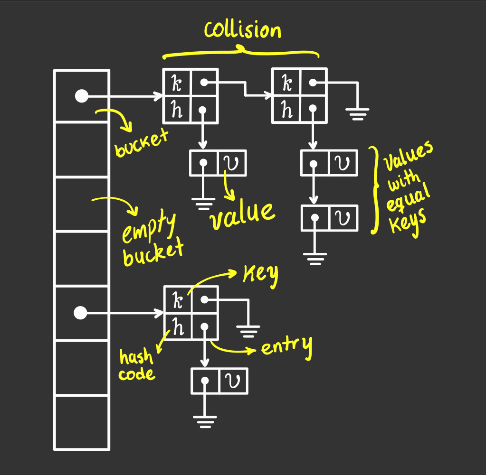

# Hash table C++ implementation

<p align="center">
  
</p>

## Requirements

Before running the project, install the following libraries:

- [```OpenSSL```](https://www.openssl.org/): to generate [```sha256```](https://en.wikipedia.org/wiki/SHA-2)

```zsh
sudo yum install openssl
sudo yum install openssl-devel
```

- [```Boost```](https://www.boost.org/): to store and operate
  with [```256 bit integers```](https://stackoverflow.com/questions/2240973/how-long-is-the-sha256-hash#:~:text=Since%20sha256%20returns%20a%20hexadecimal,same%2C%20not%20varying%20at%20all.&text=i.e.%20a%20string%20with%2064%20characters.)

```zsh
sudo yum install boost-devel
sudo yum install boost
```

To link the libraries with the project, add the following lines to ```CMakeList.txt```

```cmake
find_package(OpenSSL REQUIRED)
find_package(Boost REQUIRED)

target_link_libraries(
        ${PROJECT_NAME}
        OpenSSL::SSL
        Boost::boost
)
```

## Run the project

```zsh
git clone https://github.com/ByJuanDiego/hash-table.git
cd hash-table
cmake -B<build-dir-name> -H.
cmake --build <build-dir-name> --target all
./<build-dir-name>/hash_table
```

replace ```<build-dir-name>``` with the desire build directory name

## Member functions

$n :=$ **total** number of ```records``` in the ```hash table```

$e_{avg} :=$ **average** number of ```entries``` in a ```bucket```

$v_{avg} :=$ **average** number of ```values``` on an ```entry```

|                             Member Function                             | Big $\mathcal{O}$ performance |  Big $\Theta$ performance   |                                                                 Notes                                                                 |
|:-----------------------------------------------------------------------:|:-----------------------------:|:---------------------------:|:-------------------------------------------------------------------------------------------------------------------------------------:|
|                          ```bucket_count()```                           |       $\mathcal{O}(1)$        |    Same as $\mathcal{O}$    |                                                                   -                                                                   |
|                        ```bucket_size(int i)```                         |       $\mathcal{O}(1)$        |    Same as $\mathcal{O}$    |                                                                                                                                       |
|                            ```key_count()```                            |       $\mathcal{O}(1)$        |    Same as $\mathcal{O}$    |                                                                   -                                                                   |
|                              ```size()```                               |       $\mathcal{O}(1)$        |    Same as $\mathcal{O}$    |                                                                   -                                                                   |
|                              ```empty()```                              |       $\mathcal{O}(1)$        |    Same as $\mathcal{O}$    |                                                                   -                                                                   |
|                              ```clear()```                              |       $\mathcal{O}(n)$        |    Same as $\mathcal{O}$    |                                          if ```V``` is a pointer, records will not be freed                                           |
|                            ```find(K key)```                            |       $\mathcal{O}(n)$        |      $\Theta(e_{avg})$      |                                                        keeps the array length                                                         |
|                          ```insert(V value)```                          |       $\mathcal{O}(n)$        |      $\Theta(e_{avg})$      |                                                                   -                                                                   |
|                           ```remove(K key)```                           |       $\mathcal{O}(n)$        | $\Theta(e_{avg} + v_{avg})$ |                                                                   -                                                                   |
|                           ```search(K key)```                           |       $\mathcal{O}(n)$        | $\Theta(e_{avg} + v_{avg})$ |                                         returns empty ```std::list``` if ```key``` not exists                                         |
| ```print(std::ostream &os, Print<V> print_value, Print<K> print_key)``` |       $\mathcal{O}(n)$        |    Same as $\mathcal{O}$    | ```print_value``` and ```print_key``` has default functions for [fundamental types](https://en.cppreference.com/w/cpp/language/types) |

# Usage cases

## Initialization

```c++
using std::string;
using sha = sha2::sha256<string>;
using index_t = std::function<string(transaction *)>;
using equal_t = std::function<bool(string, string)>;

sha hash;
index_t index = [&](const transaction *tx) -> string {
    return tx->emisor;
};
equal_t equal = [&](const string &a, const string &b) -> bool {
    return (a == b);
};
hash_table<string, transaction *, sha, index_t, equal_t> hashTable(index, hash, equal);
```

Instantiates a ```hashTable``` that contains ```transaction *``` indexed by ```emisor```

- ```equal``` is an optional parameter. By default, it receives an instance of ```std::equal_to```, which works properly for built-in types. Using a non-built-int type as ```key``` makes necessary ```equal``` parameter or an [```std::equal_to``` specialization](https://en.cppreference.com/w/cpp/utility/functional/equal_to)
- ```hash``` is an instance of ```sha2::sha256```, which is well-defined for [```std::to_string``` convertable](https://en.cppreference.com/w/cpp/string/basic_string/to_string) key-types and specialized for ```std::string``` usage. To use other key-types a ```sha2::sha256``` specialization is required 
- usage of other hash functions such as [```std::hash```](https://en.cppreference.com/w/cpp/utility/hash) is allowed by passing the desire hash function as template type parameter

## Querying
```c++
std::string key = "juan-diego";
for (const transaction *t: hashTable.search(key)) {
    std::cout << t->to_string() << std::endl;
}
```

This query returns all the```transactions``` made by ```juan-diego```

## Freeing memory
If the ```value-type``` is a pointer, the pointed values will not be freed when ```hash_table::~hash_table```  is called. This is manual process.
```c++
for (transaction *tx: txs_destructor) {
    delete tx;
}
```


# To be implemented

- ```iterator``` class for the hash table
- ```shrink_to_fit``` private member function to be used to resize the hash table when deleting a certain number of keys
