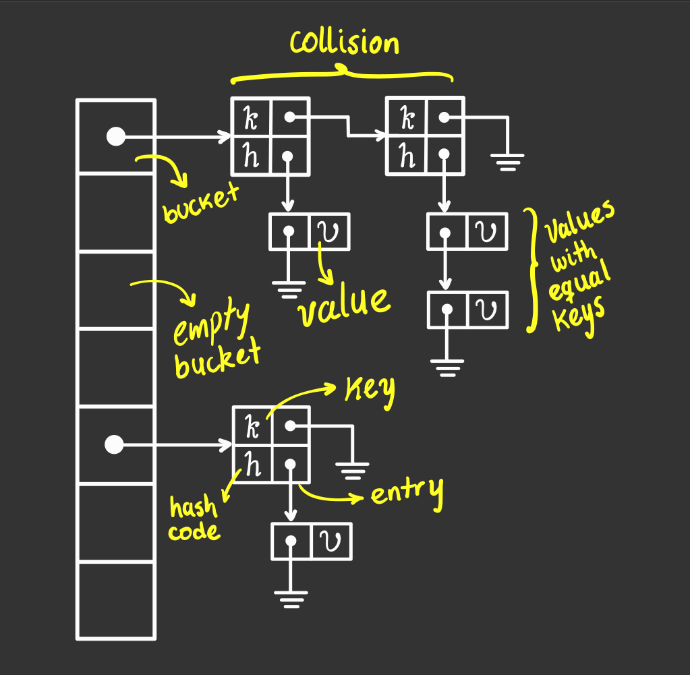

# Hash table C++ implementation

<p align="center">
  
</p>

## Requirements

Before running the project, install the following libraries:

- [```OpenSSL```](https://www.openssl.org/): to generate [```sha256```](https://en.wikipedia.org/wiki/SHA-2)

```zsh
sudo yum install openssl
sudo yum install openssl-devel
```

- [```Boost```](https://www.boost.org/): to store and operate
  with [```256 bit integers```](https://stackoverflow.com/questions/2240973/how-long-is-the-sha256-hash#:~:text=Since%20sha256%20returns%20a%20hexadecimal,same%2C%20not%20varying%20at%20all.&text=i.e.%20a%20string%20with%2064%20characters.)

```zsh
sudo yum install boost-devel
sudo yum install boost
```

To link the libraries with the project, add the following lines to ```CMakeList.txt```

```cmake
find_package(OpenSSL REQUIRED)
find_package(Boost REQUIRED)

target_link_libraries(
        ${PROJECT_NAME}
        OpenSSL::SSL
        Boost::boost
)
```

## Run the project

```zsh
git clone https://github.com/ByJuanDiego/hash-table.git
cd hash-table
cmake -B<build-dir-name> -H.
cmake --build <build-dir-name> --target all
./<build-dir-name>/hash_table
```

replace ```<build-dir-name>``` with the desire build directory name

## Macros

```c++
#define MINIMUM_REHASHING_FACTOR 2
#define DEFAULT_N_BUCKETS 10
#define DEFAULT_MAX_LOAD_FACTOR 0.75f
```

## Constraints

```c++
template<int RehashingFactor>
concept RehashingFactorConstraint = RehashingFactor >= MINIMUM_REHASHING_FACTOR;
```

```RehashingFactorConstraint```: Makes sure that ```RehashingFactor``` $\geq 2$

## Template parameters

```c++
template<
        typename K,
        typename V,
        typename Hash = std::hash<K>,
        typename Index = std::function<K(V)>,
        typename Equal = std::equal_to<K>,
        int RehashingFactor = MINIMUM_REHASHING_FACTOR
> requires RehashingFactorConstraint<RehashingFactor>
class hash_table
```

- ```K```: defines the ```key``` type to access ```values```
- ```V```: defines the type of the information (```values```) to be storage
- ```Hash```: function type used to obtain a ```hash_code``` from a determined ```key```
- ```Index```: function type used to obtain the index of a ```value```
- ```Equal```: function type used to define when two ```keys``` are equal
- ```RehashingFactor```: ```integer``` that defines
  the ```table size multiplier``` when [```rehashing```](https://www.codingninjas.com/codestudio/library/load-factor-and-rehashing) occurs

## Member variables

```c++
int k;
int v;
int b;
Hash hash;
Index index;
Equal equal;
float max_load_factor;
std::list<entry> *buckets;
```

- ```k```: total number of ```keys```
- ```v```: total number of ```values```, ```v``` $\geq$ ```k```
- ```b```: total number of ```buckets```
- ```hash```: function that recieves a ```key``` and generates a ```hash_code```
- ```index```: function that recieves a ```value``` and returns his correspondant ```key```
- ```equal```: function thar recieves two ```keys``` and returns ```true``` if are equal and ```false``` otherwise
- ```max_load_factor```: fill threshold; when exeeded, ```rehashing``` occurs
- ```buckets```: pointer to the ```array``` where ```entry lists``` are located

## Member functions

$n :=$ **total** number of ```records``` in the ```hash table```

$e_{avg} :=$ **average** number of ```entries``` in a ```bucket```

$v_{avg} :=$ **average** number of ```values``` on an ```entry```

|                             Member Function                             |    Return Type     |                                            Description                                             |       Time Compleity        |                                                                 Notes                                                                 |
|:-----------------------------------------------------------------------:|:------------------:|:--------------------------------------------------------------------------------------------------:|:---------------------------:|:-------------------------------------------------------------------------------------------------------------------------------------:|
|                          ```bucket_count()```                           |     ```int```      |                                       returns ```this->b```                                        |      $\mathcal{O}(1)$       |                                                                   -                                                                   |
|                        ```bucket_size(int i)```                         |     ```int```      |                      returns the number of ```entries``` at ```buckets[i]```                       |      $\mathcal{O}(1)$       |         if ```i``` $\geq$ ```b``` throws an [```std::runtime_error```](https://en.cppreference.com/w/cpp/error/runtime_error)         |
|                            ```key_count()```                            |     ```int```      |                                       returns ```this->k```                                        |      $\mathcal{O}(1)$       |                                                                   -                                                                   |
|                              ```size()```                               |     ```int```      |                                       returns ```this->v```                                        |      $\mathcal{O}(1)$       |                                                                   -                                                                   |
|                          ```empty(V value)```                           |     ```bool```     |               returns ```true``` if the hash table is empty, ```false``` otherwhise                |      $\mathcal{O}(1)$       |                                                                   -                                                                   |
|                              ```clear()```                              |     ```void```     |                   frees up the memory and allows to continue using the hashtable                   |      $\mathcal{O}(n)$       |                                          if ```V``` is a pointer, records will not be freed                                           |
|                            ```find(K key)```                            |     ```bool```     |          returns ```true``` if the ```key``` is on the hash table, ```false``` otherwise           |      $\Theta(e_{avg})$      |                                                        keeps the array length                                                         |
|                          ```insert(V value)```                          |     ```void```     |            inserts a new ```value``` and creates an ```entry``` if ```key``` not exists            |      $\Theta(e_{avg})$      |                              when a certain number of ```entries``` are created, ```rehashing``` occurs                               |
|                           ```remove(K key)```                           |     ```bool```     |       removes the ```entry``` that contains all the ```values``` which key equals ```key```        | $\Theta(e_{avg} + v_{avg})$ |                                              returns ```false``` if ```key``` not exists                                              |
|                           ```search(K key)```                           | ```std::list<V>``` | returns an ```std::list``` with all the ```values``` at the ```entry``` where key equals ```key``` | $\Theta(e_{avg} + v_{avg})$ |                                         returns empty ```std::list``` if ```key``` not exists                                         |
| ```print(std::ostream &os, Print<V> print_value, Print<K> print_key)``` |     ```void```     |                                     display all the hash table                                     |      $\mathcal{O}(n)$       | ```print_value``` and ```print_key``` has default functions for [fundamental types](https://en.cppreference.com/w/cpp/language/types) |

## Usage cases

```c++
// todo
```
